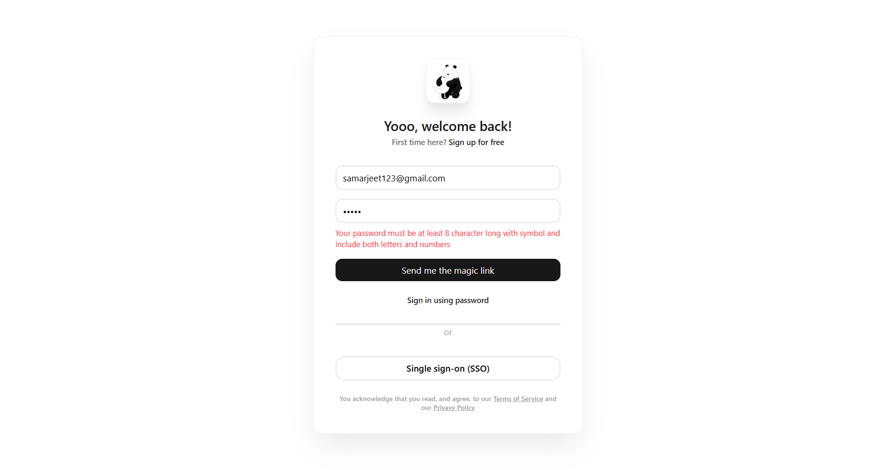

# LogForm — React Login Validation Component

## Project Overview

This folder contains a small React login form feature built with Vite and Tailwind CSS. It demonstrates a clean, reusable form implementation with real-time validation for email and password inputs, plus a lightweight success notification flow.

The feature is intended as a polished frontend exercise that showcases practical UI validation, user interaction feedback, and component-level state management.

## Key Features

- Email validation using a standard regular expression pattern
- Password validation enforcing:
  - minimum 8 characters
  - at least one lowercase letter
  - at least one uppercase letter
  - at least one digit
  - at least one symbol from @$!%*?&
- Immediate validation messaging for both fields
- Form submission guard that only triggers success when all validation rules pass
- Toast-style success notification rendered conditionally after valid submission
- Modern layout using Tailwind CSS utility classes

## What This Demonstrates

This implementation highlights several practical frontend skills:

- Building reusable React components with props-driven callbacks (`Form` and `Tost`)
- Managing controlled form inputs and local validation state with `useState`
- Applying validation logic in response to user input and form submission events
- Handling side effects in the UI, including transient notification state
- Creating a clean and responsive form layout without external UI libraries

## Folder Structure

- `src/App.jsx` — root component, controls toast visibility and passes the success handler to the form
- `src/components/Form.jsx` — login form component with validation logic and conditional error messaging
- `src/components/Tost.jsx` — success notification component displayed after a valid submission
- `package.json` — Vite, React, and Tailwind CSS dependencies

## Screenshot



## How to Run

Install dependencies and start the local development server:

```bash
npm install
npm run dev
```

The app runs in development mode with HMR enabled via Vite.

## Learning Outcomes

This feature is a strong example of how to build a production-minded form experience in React:

- Practical use of regular expressions for client-side validation
- Clear separation between UI markup and validation logic
- Intentional user feedback using inline error messages and toast notifications
- Awareness of UX details such as resetting form values after submission
- Confidence with Tailwind CSS utility styling in a React application

## Notes for Reviewers

This implementation is focused on frontend validation and UI behavior. It is intentionally decoupled from backend authentication, making it a good fit as a reusable validation component or a portfolio demonstration of form handling best practices.